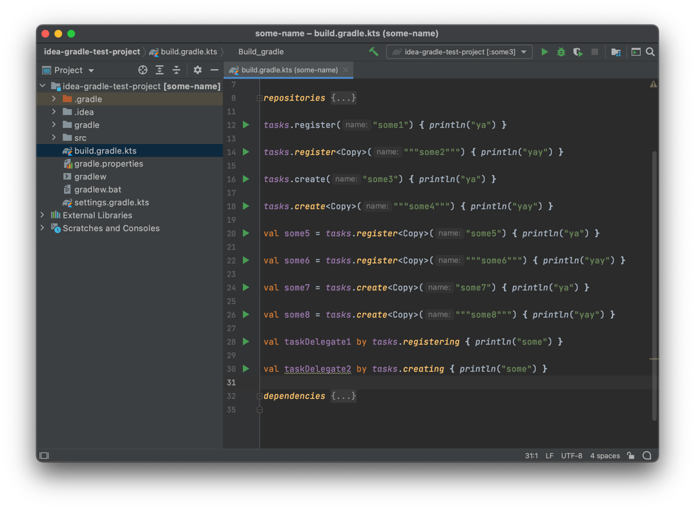

#   Gradle Run Gutter Icons

<!-- Plugin description -->
This simple plugin adds run gutter icons for the `build.gradle.kts` tasks declarations. Then clicked, it executes declared gradle task just like `Execute Gradle Task` action.

Currently, it only supports these types of task declaration:
* `tasks.register(<taskName>)`
* `tasks.create(<taskName>)`
* `val task = tasks.register(<taskName>)`
* `val task = tasks.create(<taskName>)`
* `val task by tasks.registering(<taskName>)`
* `val task by tasks.creating(<taskName>)`

<!-- Plugin description end -->

## Installation

* Using IDE built-in plugin system:

  <kbd>Settings/Preferences</kbd> > <kbd>Plugins</kbd> > <kbd>Marketplace</kbd> > <kbd>Search for "Gradle Run Gutter Icons</kbd> >
  <kbd>Install Plugin</kbd>

* Manually:

  Download the [latest release](https://github.com/FirstTimeInForever/gradle-run-gutter-icons/releases/latest) and install it manually using
  <kbd>Settings/Preferences</kbd> > <kbd>Plugins</kbd> > <kbd>⚙️</kbd> > <kbd>Install plugin from disk...</kbd>

Gradle Run Gutter Icons plugin is based on the [IntelliJ Platform Plugin Template](https://github.com/JetBrains/intellij-platform-plugin-template).
